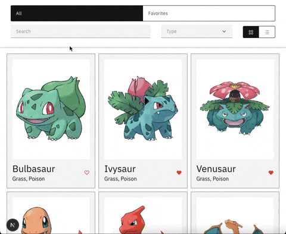
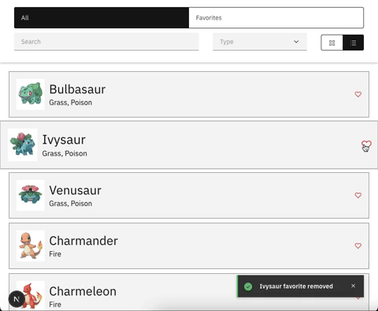

# Pokedex challenge

Built on the base of  [repo](https://gitlab.com/brainsoft-eu/frontend-code-challenge/-/tree/master?ref_type=heads)

Utilizes React/Next.js + Apollo + Redux + Carbon elements for quick iteration.

Find the final product recordings below

